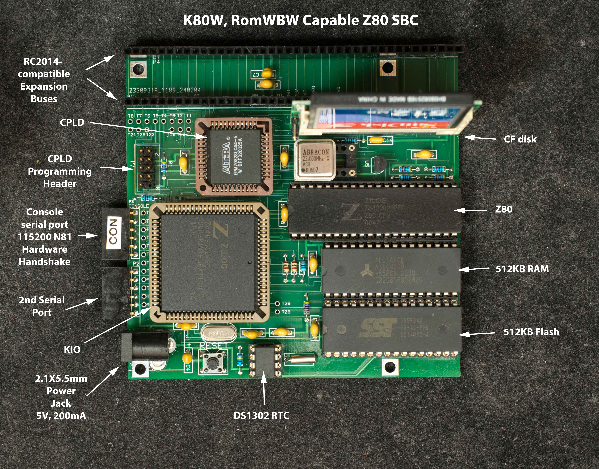
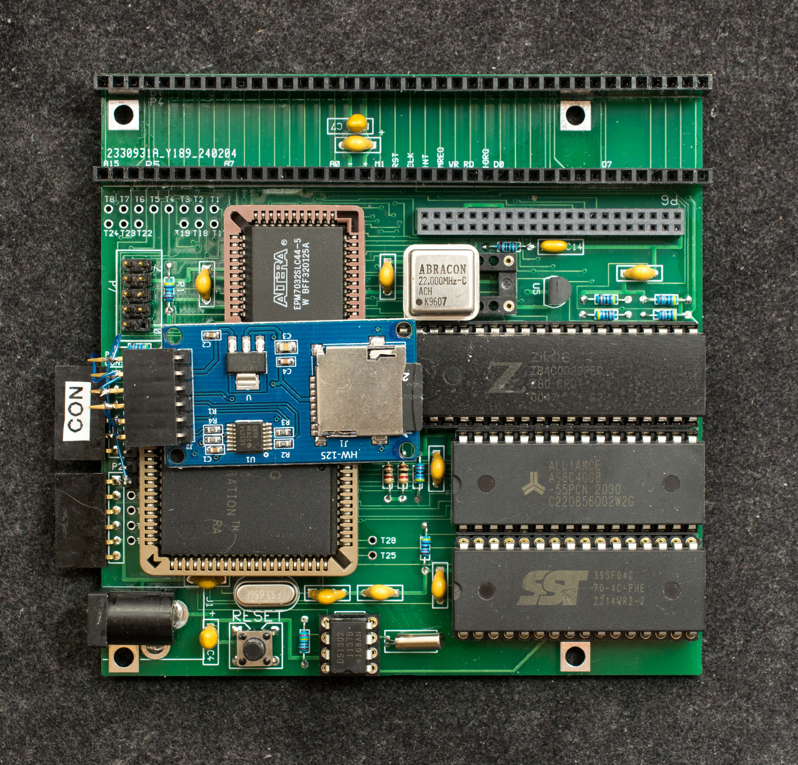

# K80W Rev1, A RomWBW-capable Z80 SBC
### Introduction
**Note, K80W rev1 is superceded by [K80W rev2.1](../K80W_Rev2)**

K80W is similar to K80. It is a 22MHz Z80 SBC with KIO (Z84C90) as the I/O device. It is designed to run RomWBW

## Features
- Z80 overclocked to 22MHz,
- 512KB Flash divided into 16 32KB banks,
- 512KB RAM divided into 16 32KB banks,
- KIO, Z84C90, is the integrated I/O interface,
- DS1302 Real Time Clock,
- Compact Flash interface,
- Designed for RomWBW
- Two 40-pin RC2014-compatible expansion slots,
- 100mm X 100mm, 2-layer PC board,
## Design Files
- [Schematic](k80w_rev1_scm.pdf)
- [Gerber photoplots](k80w_rev1_gerber.zip)
- [CPLD design files](k80w_r1pcb_cpld_epm7032s.zip)
- Bill of Materials

## Software
### Adding SD to K80W

  - PB0 to MOSI,
  - PB7 to MISO,
  - PB3 to CS and
  - PB4 to CLK
### RomWBW Configuration
The following modifications to RCZ80_K80W.ASM file is needed:

SDENABLE .SET TRUE ; SD: ENABLE SD CARD DISK DRIVER (SD.ASM)
SDMODE .SET SDMODE_PIO ; SD: DRIVER MODE: SDMODE_[JUHA|N8|CSIO|PPI|UART|DSD|MK4|SC|MT|PIO|Z80R|USR]

This is the resulting [RCZ80_K80W.ASM](Software/rcz80_k80w.asm)

The I/O addresses for SDMODE_PIO is hardwired to $69. It is necessary to modify SD.ASM in HBIOS as follow:

SD_IOBASE .EQU $82 ; IO BASE ADDRESS FOR SD INTERFACE

SD_DDR .EQU $83 ; DATA DIRECTION REGISTER

This is the resulting [ROM binary file](Software/rcz80_k80w_rom_sd.zip) that recognizes SD card connected to PIO:
