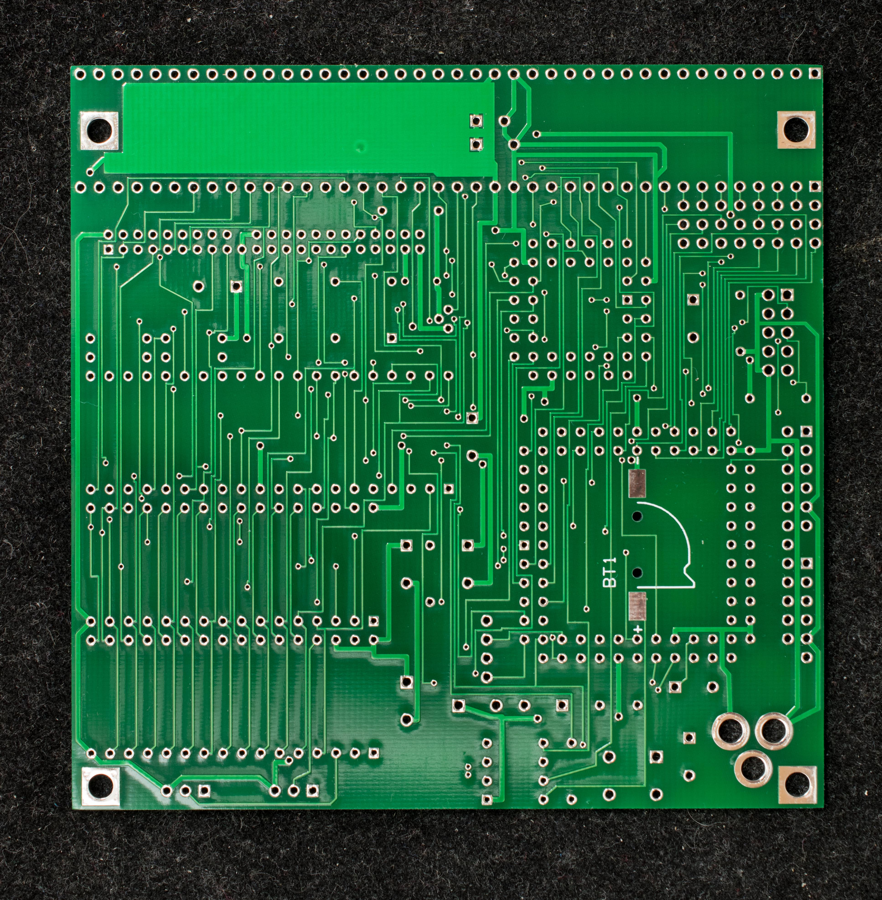
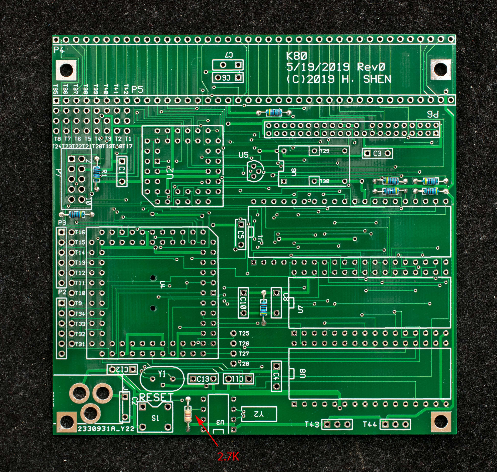
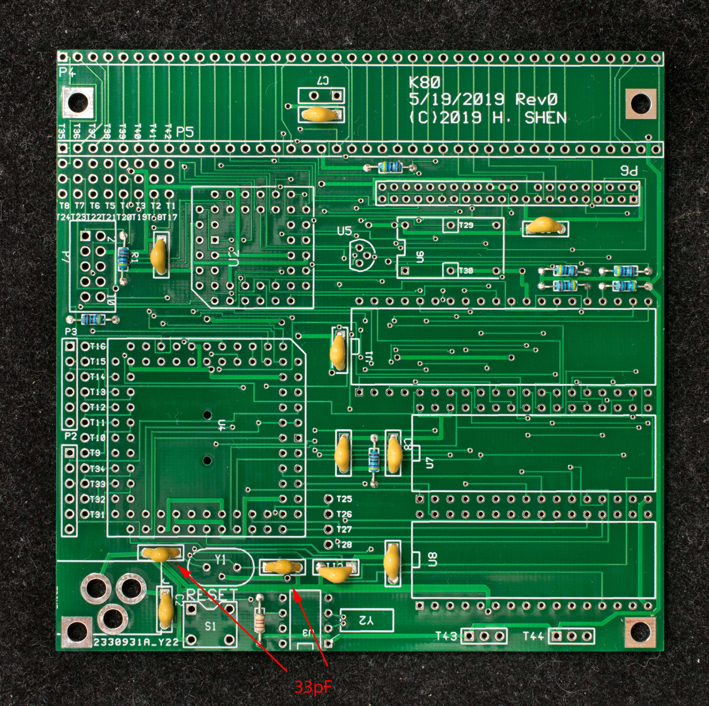
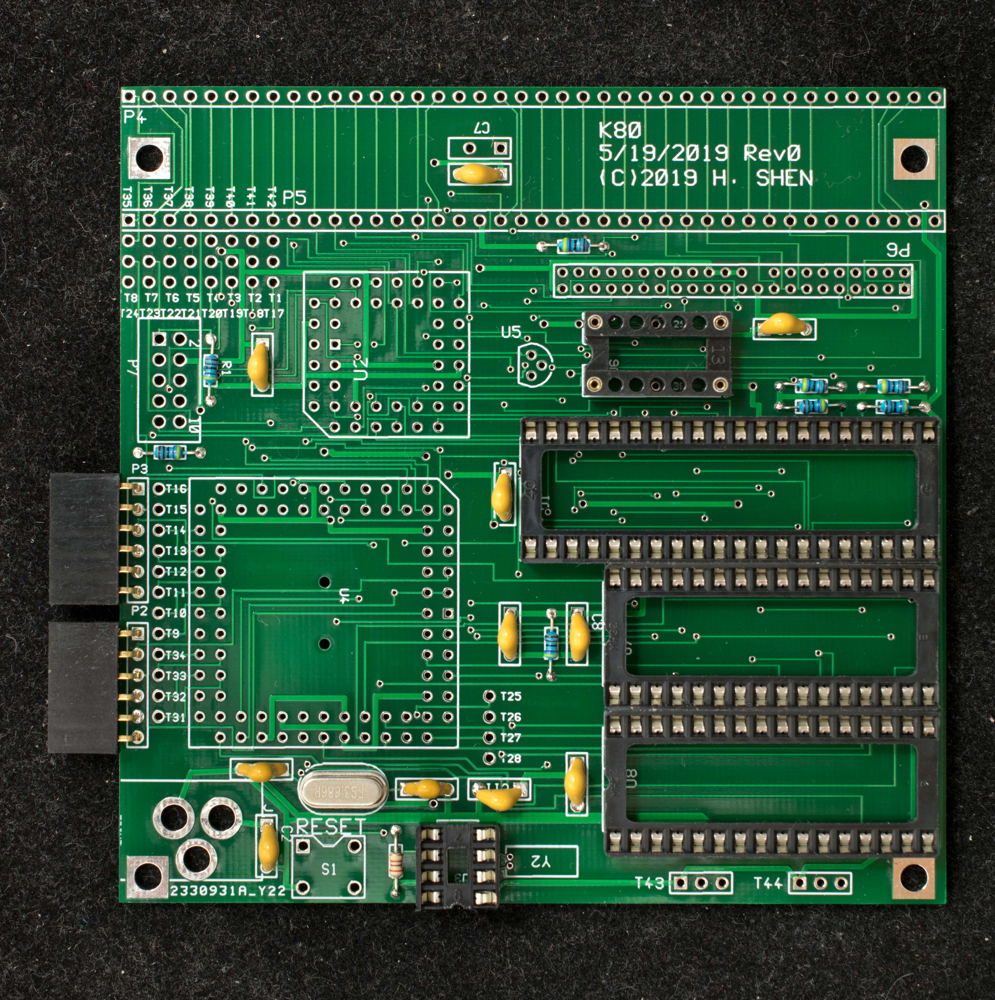
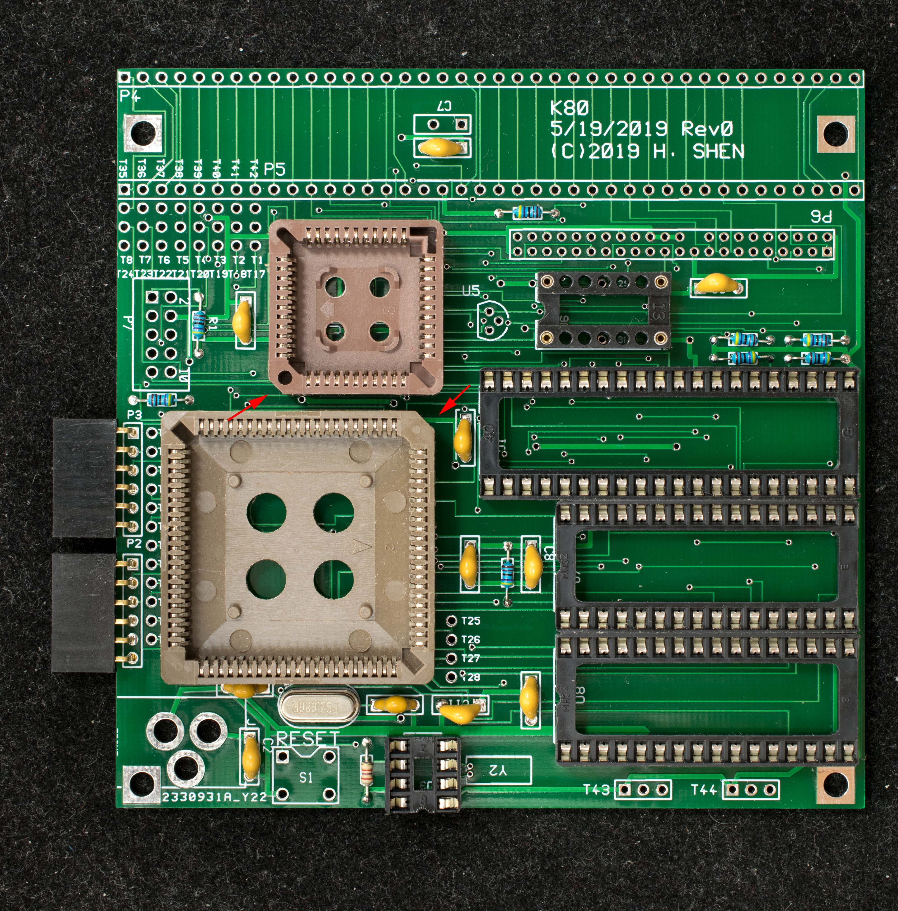
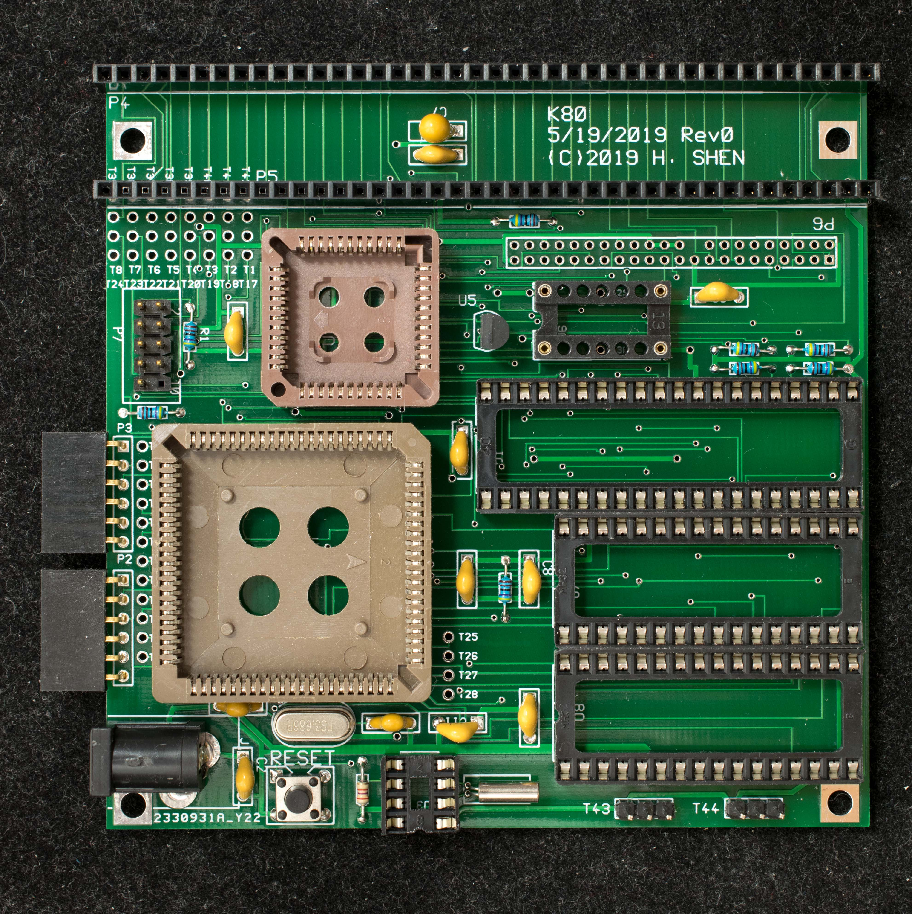

# Pictorial Assembly Guide of K80
The order of assembly is based on the height of the components, the lowest components are soldered down first and the tallest last.

Bare PC board, component side

Bare board, solder side

Install the resistors first; the resistors are all 4.7K except R3 (indicated by a red arrow) which is 2.7K.

Install capacitors next; capacitor values are all 0.1uF except C12 and C13 (indicated by red arrows) which are 33pF.

Install IC sockets.

Install PLCC sockets, observe the orientation of the sockets as indicated by the red arrows.

The completed board.

11/15/23. Engineering changes for KIO

