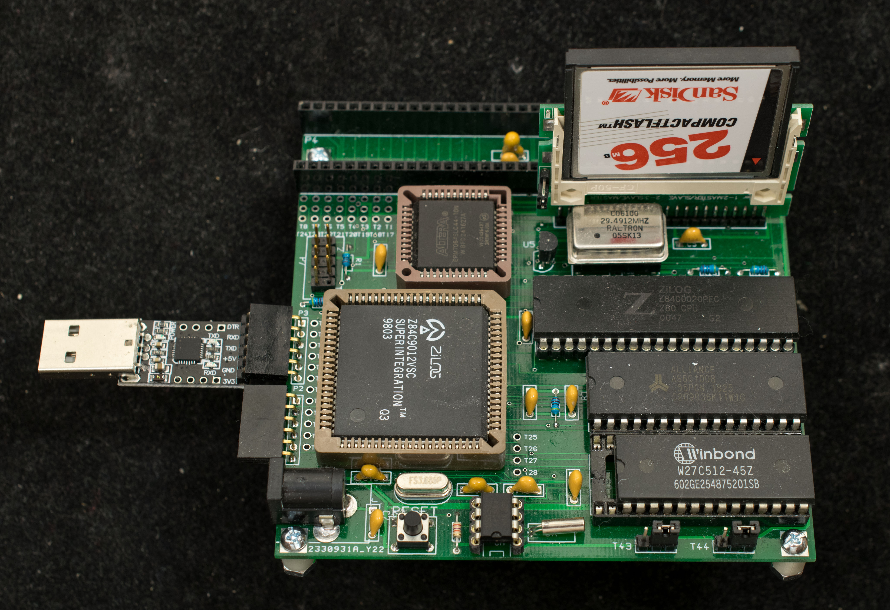
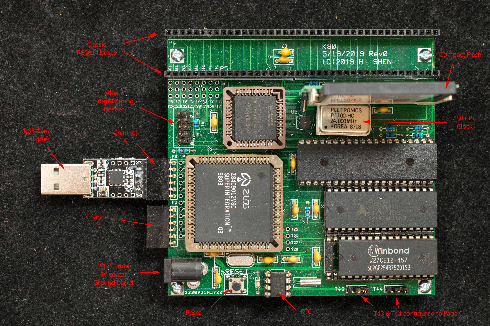
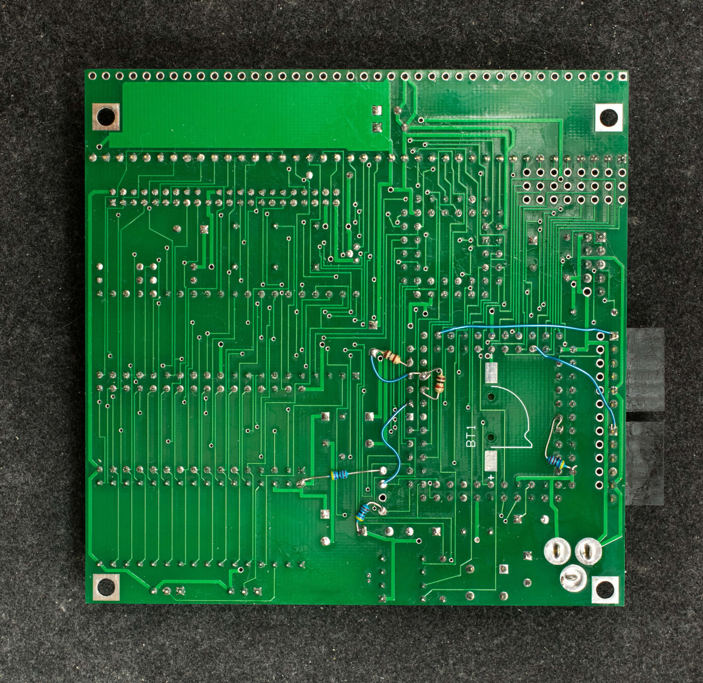

# K80 Rev0 A Traditional Z80 with KIO
### Introduction
K80 is a traditional SBC design using a KIO (Z84C9012) and over-clocked to 22MHz. It also has 2 RC2014 40-pin expansion connectors.

Winter 2022 update: K80 rev0 was designed in May 2019, the design has undergone changes in preparation for rev1 PCB update. The bulk of the changes dealt with the memory bank to emulate the logic of RC2014's 512K RAM/ROM board. This allows K80 to run the standard ROMWBW software with KIO. 

Winter 2022 2nd update: With faster RAM and flash, K80 can run reliably at 29.49MHz. It can emulate RC2014Pro platform but running much faster.

### Features
- Z80 with 64K EEPROM and 128K RAM,
- Z80 overclocked to 22MHz,
- EEPROM in four 16K banks, bootstrap from any of the 4 banks via jumper selection,
- Sixteen 16K banked memory,
- KIO, Z84C90, is the integrated I/O interface,
- DS1302 Real Time Clock,
- Compact Flash interface,
- CP/M-ready,
- Two 40-pin RC2014 expansion slots,
- 100mm X 100mm, 2-layer PC board,
- Designed for RC2014.

### Design files
- [Schematic](k80_rev0_scm.pdf) of K80
- [Gerber photoplots](k80_cpld_1.zip) of K80
- Altera [EPM7064SLC44 design file](k80_cpld_1.zip)

Engineering changes. Rev0 pc board requires a number of engineering changes. Click on picture below to see the engineering changes under the KIO chip. All resistors are 4.7K

### Software
- K80 Monitor. Hex file to be programmed in the W27C512.
- CP/M2.2 for K80. CP/M2.2 BDOS/CCP/BIOS

### Manuals
- Getting started with K80
- K80 Monitor guide
- Installing software on a new CF for K80
- Pictorial Assembly Guide

builderpages/plasmo/k80.txt
