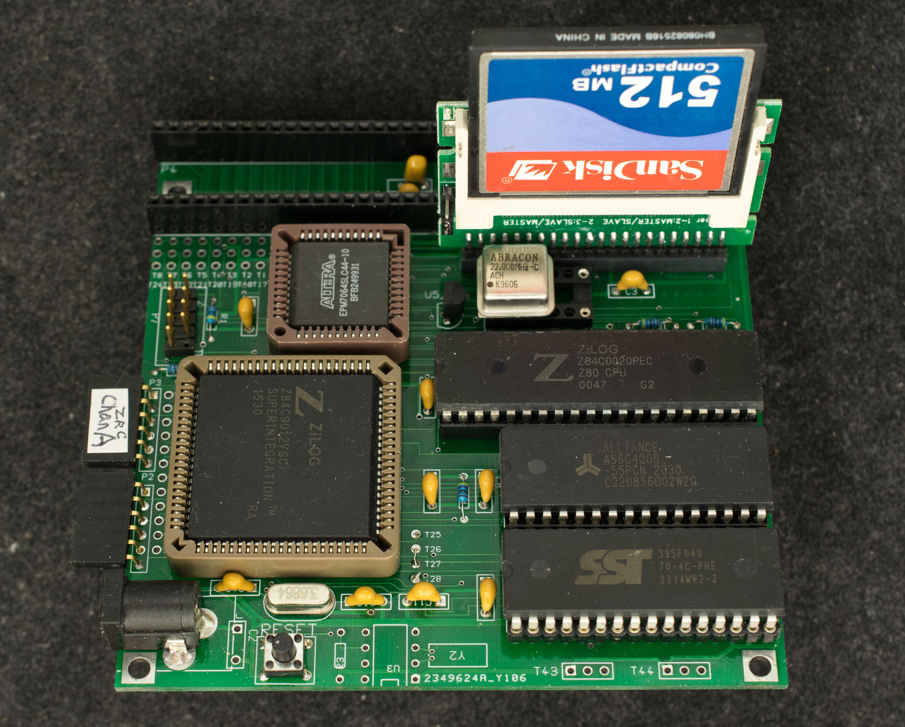
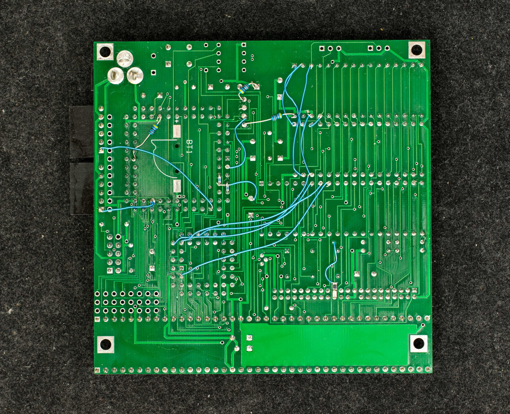

# K80 Rev1
### Introduction
K80 has a number of minor engineering changes, but a major improvement in its memory bank logic will let it work with the standard version of ROMWBW-KIO software and more closely aligned with RC2014 family of products.

### Features
- Z80 overclocked to 22MHz
- 512K flash, SST39SF040
- 512K RAM
- KIO (Z84C90) configured to I/O address 0x80-0x8F
- Compact flash interface
- DS1302 RTC
- Two RC2014 expansion slots
- Economical 100mmX100mm 2-layer PC board

### Design
- Schematic
- Design Changes from rev0 pc board
